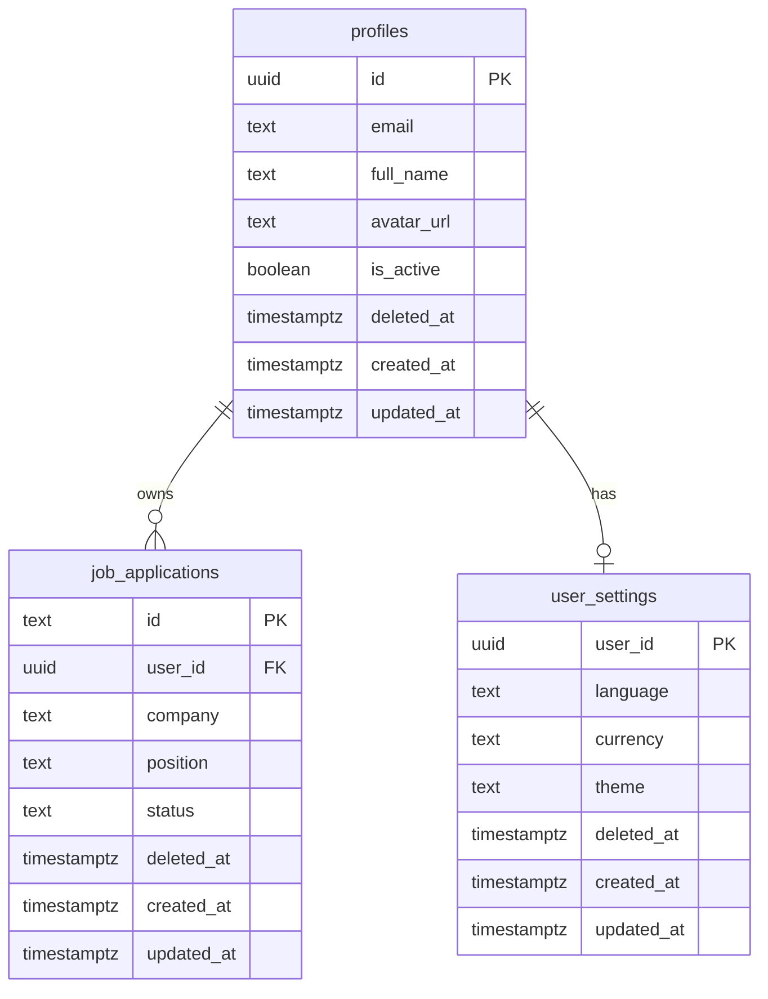

# Database

Siftly uses **Supabase** (managed PostgreSQL) as its remote database. The schema, security policies, and migration files live in the `supabase/migrations/` directory.

## Schema Overview



### Tables

| Table              | Purpose                                  | Key columns                                      |
| ------------------ | ---------------------------------------- | ------------------------------------------------ |
| `profiles`         | User identity, synced from Supabase Auth | `id`, `email`, `full_name`, `is_active`          |
| `job_applications` | All tracked job applications             | `id`, `user_id`, `company`, `position`, `status` |
| `user_settings`    | Per-user preferences                     | `user_id`, `language`, `currency`, `theme`       |

## Row Level Security (RLS)

Every table has RLS enabled. All policies enforce `auth.uid() = user_id` so users can only access their own data. Policies also check that the user's profile is active (not deactivated).

```sql
-- Example: users can only see their own active applications
CREATE POLICY "Users can view own applications"
  ON public.job_applications FOR SELECT
  USING (
    auth.uid() = user_id
    AND deleted_at IS NULL
    AND EXISTS (SELECT 1 FROM profiles WHERE id = auth.uid() AND deleted_at IS NULL)
  );
```

## Data Recovery

All delete operations in Siftly are **non-destructive**. When a user deletes an application, the record is marked with a `deleted_at` timestamp rather than being physically removed. This design enables:

- **Undo capability** — accidentally deleted data can be recovered
- **Graceful account management** — deactivated accounts can be reactivated with data intact
- **Data integrity** — no risk of irreversible data loss from user error

From the user's perspective, deleted items disappear immediately. The RLS policies automatically filter out any record where `deleted_at IS NOT NULL`, so the application never sees archived data.

### Server-Side Functions

| RPC                               | Description                                                     |
| --------------------------------- | --------------------------------------------------------------- |
| `soft_delete_application(app_id)` | Archives a single job application                               |
| `soft_delete_all_applications()`  | Archives all applications for the current user                  |
| `soft_delete_account()`           | Deactivates the user's profile and archives all associated data |

## Migrations

Database schema changes are managed as SQL migration files in `supabase/migrations/`. Each file is timestamped and applied in order:

```
supabase/migrations/
├── 20260404120000_initial_schema.sql
├── 20260408120000_soft_delete.sql
└── 20260409180000_enable_auth_trigger.sql
```

### Applying Migrations

**Locally / manually**: Run the SQL in the Supabase SQL Editor.

**Via CI/CD**: The `DB Migration` GitHub Action runs automatically when migration files are pushed to `main`, or can be triggered manually. See [CI/CD Pipeline](../deployment/ci-cd) for details.

## Account Lifecycle

When a user deletes their account:

1. All active applications are archived (`deleted_at = now()`)
2. User settings are archived
3. The profile is marked as inactive (`is_active = false`, `deleted_at = now()`)
4. The user is signed out

If the same email is used to create a new account later, a brand new profile is created. The previous data remains archived and is never visible to the new account.

## Automatic Profile Creation

To ensure a seamless onboarding experience and maintain RLS integrity, Siftly uses a database trigger to automatically create a row in the `public.profiles` table whenever a new user signs up via Supabase Auth.

- **Trigger**: `on_auth_user_created` on `auth.users`
- **Function**: `public.handle_new_user()`
- **Migration**: `20260409180000_enable_auth_trigger.sql`

This automation ensures that Row-Level Security policies (which often depend on the existence of a profile) do not block initial data insertions for new users.
